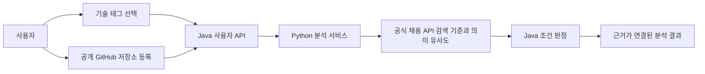
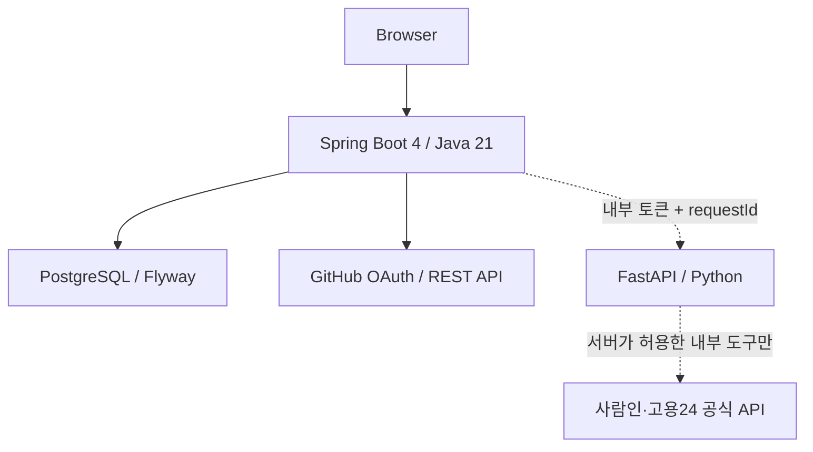
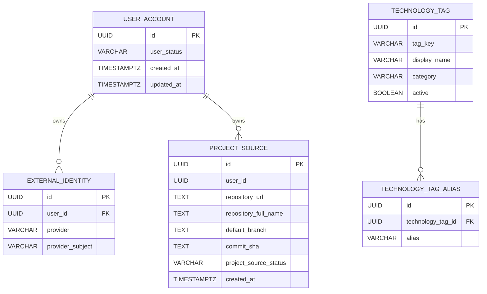

# Career Compass AI

공개 GitHub 저장소와 사용자가 직접 선택한 기술 태그를 근거로 개발자 채용공고를 비교하는 AI 취업 방향 분석 서비스입니다.

## MVP 범위

분석 입력은 다음 두 가지로 제한합니다.

- 사용자가 직접 선택한 표준 기술 태그
- 사용자가 직접 등록한 공개 GitHub 저장소

PDF, 이력서와 포트폴리오 입력은 2026-08-03 결정으로 MVP에서 제거했습니다. 이름·연락처·상세 주소 같은 개인정보는 분석 입력으로 사용하지 않습니다.

## 핵심 흐름



현재 브라우저는 기술 태그 검색·선택, GitHub 저장소 등록과 Python 연결 확인까지 실제 서버 응답으로 표시합니다. 분석 작업 API와 SSE가 연결되기 전에는 성공 결과를 만들지 않습니다.

## 구현 상태

Java(백엔드) 쪽은 인증부터 분석 작업 상태 관리까지 상당히 진행됐고, Python(AI) 쪽은 채용공고 원문을 구조화 추출하는 기능만 Java와 연결됐습니다. 저장소 근거와 채용공고를 실제로 비교해 적합도를 판정하는 단계(임베딩·유사도·랭킹)는 아직 Java와 연결되지 않아 AI 쪽이 상대적으로 부족한 상태입니다.

| 영역 | 기능 | 상태 |
|---|---|---|
| Java | GitHub OAuth 로그인 | 브라우저 확인 |
| Java | 공개 GitHub 저장소 검증·등록 | 통합 확인 |
| Java | 프로젝트 출처 목록 | 단위·PostgreSQL 통합 테스트 |
| Java | 표준 기술 태그 검색 | 단위·PostgreSQL 통합 테스트 |
| Java | 내부 기술 태그 정규화 | 단위·PostgreSQL 통합 테스트 |
| Java | Python 상태 확인 | 단위 테스트·브라우저 확인 |
| Java | 요청 ID와 안전한 구조화 로그 | 단위·전체 회귀 테스트 |
| Java | 분석 작업 생성(QUEUED) | 구현·통합 테스트 |
| Java | 분석 작업 Worker·채용공고 Provider·Python 추출 연결 | PR #48 리뷰 중(develop 미병합) |
| Java | 분석 결과 API·비교 단계·SSE | 구현 예정 |
| Python | 채용공고 원문 구조화 추출(Ollama, 실패 시 Gemini 폴백) | 구현, Java 연결(PR #48 검증 중) |
| Python | 저장소 근거 추출·임베딩·유사도·랭킹(비교 단계) | Python 단위 테스트만 있음, Java 연결·비교 로직 미착수 |
| 프론트 | 기술 태그 선택·GitHub 등록 | 구현 |
| 프론트 | 실제 분석 진행·결과 | Java 분석 결과 API 연결 예정 |

상세 검증 상태는 [현재 작업 상태](docs/current-work.md)를 기준으로 확인합니다.

## 시스템 구성



- Java는 인증·인가, 사용자 소유권, 공식 외부 API 호출, 상태 저장과 규칙 판정을 담당합니다.
- Python은 저장소 근거 추출, 구조화, 임베딩과 의미 유사도를 담당합니다.
- Python은 임의 인터넷 접속을 하지 않고 Java가 제공하는 허용된 내부 도구만 사용합니다.
- 조건 판정과 의미 유사도는 하나의 불투명한 점수로 합치지 않습니다.

## 현재 API

모든 사용자 API 응답은 `requestId`, `data`, `error`, `timestamp` 봉투를 사용합니다.

| Method | Endpoint | 기능 |
|---|---|---|
| `GET` | `/api/v1/auth/me` | 현재 로그인 상태 |
| `GET` | `/api/v1/auth/csrf` | CSRF 토큰 |
| `POST` | `/api/v1/auth/logout` | 로그아웃 |
| `POST` | `/api/v1/project-sources/github` | 공개 GitHub 저장소 검증·등록 |
| `GET` | `/api/v1/project-sources` | 현재 사용자의 프로젝트 출처 |
| `GET` | `/api/v1/technology-tags?query=` | 표준 기술 태그 검색 |
| `POST` | `/internal/v1/technology-tags/resolve` | 내부 기술 태그 정규화 |
| `GET` | `/api/v1/system/python-status` | Python 연결 상태 |
| `GET` | `/actuator/health` | Java 상태 확인 |

분석 시작·상태·이벤트·취소·결과 API는 [개발자 채용공고 분석 API](docs/api/developer-job-analysis-api.md)를 구현 기준으로 사용합니다.

## 데이터 구조



이미 적용된 `V1__create_user_document.sql`은 Flyway 이력 보호를 위해 수정하거나 삭제하지 않습니다. `user_document` 테이블은 현재 API와 분석에서 사용하지 않으며, 실제 데이터와 테이블 삭제는 별도 신규 마이그레이션 승인을 받아야 합니다.

## 프로젝트 구조

```text
career-compass-ai/
├─ backend-java/   Java 사용자 API, 보안, 저장과 분석 제어
├─ ai-python/      저장소 근거 추출, 임베딩과 의미 유사도
├─ contracts/      Java–Python 요청·응답 계약
├─ docs/           API, 정책, 설계와 결정 기록
├─ deploy/         배포 설정
└─ postman/        HTTP 통합 검증 자료
```

## 로컬 실행

Java는 Linux에서 `backend-java`만 열고 실행합니다.

필수 환경변수:

```text
DB_HOST
DB_PORT
DB_NAME
DB_USERNAME
DB_PASSWORD
GITHUB_OAUTH_CLIENT_ID
GITHUB_OAUTH_CLIENT_SECRET
GITHUB_API_CONNECT_TIMEOUT
GITHUB_API_READ_TIMEOUT
PYTHON_WORKER_BASE_URL
INTERNAL_SERVICE_TOKEN
SPRING_PROFILES_ACTIVE
```

선택 가능한 기술 태그 제한은 다음 설정으로 관리합니다.

```text
TECHNOLOGY_TAG_MAX_QUERY_LENGTH
TECHNOLOGY_TAG_MAX_SEARCH_RESULTS
TECHNOLOGY_TAG_RESOLUTION_MAX_NAMES
TECHNOLOGY_TAG_RESOLUTION_MAX_NAME_LENGTH
```

Linux 테스트:

```bash
cd backend-java
/home/mycom/.sdkman/candidates/gradle/8.14.3/bin/gradle test --no-daemon
```

## 보안과 로그

- 일반 로그에 원문, 저장소 파일 내용, OAuth 토큰, 내부 토큰과 개인정보를 기록하지 않습니다.
- 응답 헤더·응답 봉투·Java 로그·Python 요청은 같은 `requestId`로 연결합니다.
- GitHub 검증과 Python 상태 호출은 성공·실패와 소요 시간만 기록합니다.
- 사용자별 데이터는 인증된 Security Context의 사용자 식별자로 격리합니다.

## 관련 문서

- [AI 협업 규칙](AGENTS.md)
- [현재 작업 상태](docs/current-work.md)
- [분석 작업과 SSE 설계](docs/architecture/backend-job-processing-and-sse.md)
- [개발자 채용공고 분석 API](docs/api/developer-job-analysis-api.md)
- [채용공고 검색 도구 계약](contracts/job-search-tool.md)
- [채용공고 추출 계약](contracts/job-posting-extraction.md)
