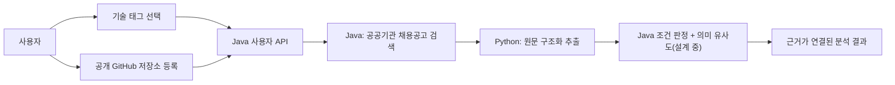
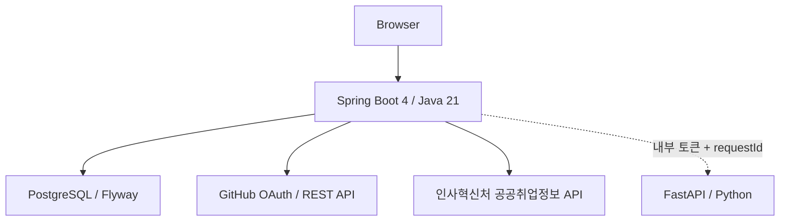
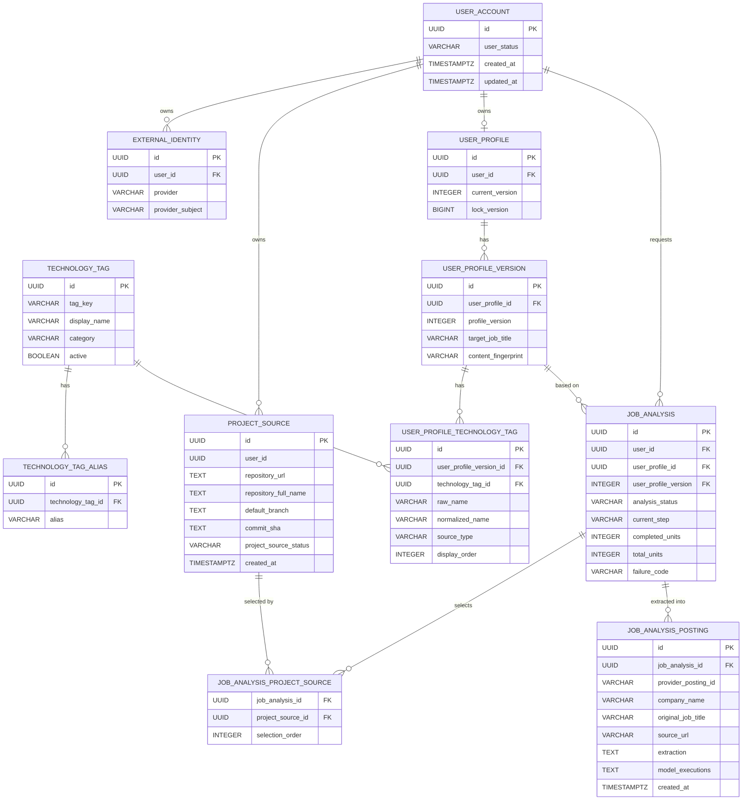

# Career Compass AI

공개 GitHub 저장소와 사용자가 직접 선택한 기술 태그를 근거로 개발자 채용공고를 비교하는 AI 취업 방향 분석 서비스입니다.

## MVP 범위

분석 입력은 다음 두 가지로 제한합니다.

- 사용자가 직접 선택한 표준 기술 태그
- 사용자가 직접 등록한 공개 GitHub 저장소

PDF, 이력서와 포트폴리오 입력은 2026-08-03 결정으로 MVP에서 제거했습니다. 이름·연락처·상세 주소 같은 개인정보는 분석 입력으로 사용하지 않습니다.

## 핵심 흐름



현재 브라우저는 기술 태그 검색·선택, GitHub 저장소 등록과 Python 연결 확인까지 실제 서버 응답으로 표시합니다. 분석 작업은 실제로 공공기관 채용공고를 검색해 Python이 구조화 추출까지 끝까지 수행하는 것을 확인했습니다(2026-08-11). 비교(적합도 판정) 단계와 결과 API·SSE가 연결되기 전에는 최종 성공 결과를 만들지 않습니다.

## 구현 상태

Java(백엔드)는 인증부터 실제 공공기관 채용공고 검색·추출 연결까지 끝까지 도는 것을 확인했습니다(2026-08-11, 엔드투엔드). Python(AI)은 채용공고 원문 구조화 추출은 실제로 검증됐지만, 저장소 근거와 채용공고를 비교해 적합도를 내는 단계(의미 유사도)는 아직 구현 전이고 방식 자체도 확정 전입니다 — 임베딩 방식(PR #63)과 LLM-as-judge 방식(PR #62) 두 제안이 나와 있고, 임베딩 방식은 실측으로 도메인 구분 실패가 확인돼 재검토 중입니다.

| 영역 | 기능 | 상태 |
|---|---|---|
| Java | GitHub OAuth 로그인 | 브라우저 확인 |
| Java | 공개 GitHub 저장소 검증·등록 | 통합 확인 |
| Java | 프로젝트 출처 목록 | 단위·PostgreSQL 통합 테스트 |
| Java | 표준 기술 태그 검색 | 단위·PostgreSQL 통합 테스트 |
| Java | 내부 기술 태그 정규화 | 단위·PostgreSQL 통합 테스트 |
| Java | Python 상태 확인 | 단위 테스트·브라우저 확인 |
| Java | 요청 ID와 안전한 구조화 로그 | 단위·전체 회귀 테스트 |
| Java | 분석 작업 생성(QUEUED) | 구현·통합 테스트 |
| Java | 공공기관 채용공고 검색(인사혁신처 API)·Worker·Python 추출 연결 | 구현, 엔드투엔드 확인 |
| Java | 분석 결과 API·비교 단계·SSE | 구현 예정, 계약 설계 논의 중(PR #62·#63) |
| Python | 채용공고 원문 구조화 추출(Ollama, 실패 시 Gemini 폴백) | 구현, Java 연결·엔드투엔드 확인 |
| Python | 저장소 근거 추출·의미 유사도(비교 단계) | 미구현, 방식 설계 논의 중(임베딩 vs LLM-as-judge) |
| 프론트 | 기술 태그 선택·GitHub 등록 | 구현 |
| 프론트 | 실제 분석 진행·결과 | Java 분석 결과 API 연결 예정 |

상세 검증 상태는 [현재 작업 상태](docs/current-work.md)를 기준으로 확인합니다.

## 시스템 구성



- Java는 인증·인가, 사용자 소유권, 공식 외부 API 호출(공공기관 채용공고 검색), 상태 저장과 규칙 판정을 담당합니다.
- Python은 채용공고 원문 구조화 추출(구현됨)과 저장소 근거·의미 유사도(설계 논의 중)를 담당합니다.
- Python은 임의 인터넷 접속을 하지 않습니다 — 외부 API 호출은 전부 Java가 하고, Python은 Java가 전달한 텍스트만 받습니다.
- 조건 판정과 의미 유사도는 하나의 불투명한 점수로 합치지 않습니다.

## 현재 API

모든 사용자 API 응답은 `requestId`, `data`, `error`, `timestamp` 봉투를 사용합니다.

| Method | Endpoint | 기능 |
|---|---|---|
| `GET` | `/api/v1/auth/me` | 현재 로그인 상태 |
| `GET` | `/api/v1/auth/csrf` | CSRF 토큰 |
| `POST` | `/api/v1/auth/logout` | 로그아웃 |
| `POST` | `/api/v1/project-sources/github` | 공개 GitHub 저장소 검증·등록 |
| `GET` | `/api/v1/project-sources` | 현재 사용자의 프로젝트 출처 |
| `GET` | `/api/v1/technology-tags?query=` | 표준 기술 태그 검색 |
| `POST` | `/internal/v1/technology-tags/resolve` | 내부 기술 태그 정규화 |
| `GET` | `/api/v1/system/python-status` | Python 연결 상태 |
| `GET` | `/actuator/health` | Java 상태 확인 |

분석 시작·상태·이벤트·취소·결과 API는 [개발자 채용공고 분석 API](docs/api/developer-job-analysis-api.md)를 구현 기준으로 사용합니다.

### Python 내부 API (ai-python)

브라우저가 직접 호출하지 않고 Java `pythonworker`만 호출하는 내부 API입니다. 모든 요청에 `X-Internal-Token` 헤더가 필요합니다.

| Method | Endpoint | 기능 | 상태 |
|---|---|---|---|
| `GET` | `/internal/v1/health` | Python 상태 확인 | 구현, Java 연결 확인 |
| `POST` | `/internal/v1/job-postings/extract` | 채용공고 원문 구조화 추출(Ollama, 실패 시 Gemini 폴백) | 구현, Java 연결·엔드투엔드 확인 |

계약: [채용공고 추출 계약](contracts/job-posting-extraction.md). 저장소 근거 추출·임베딩·유사도·랭킹(`ai-python/app/services`)은 아직 API로 노출되지 않아 Java가 호출할 수 없습니다.

## 데이터 구조



`job_analysis`는 분석 대상 저장소를 `job_analysis_project_source`로 선택해 참조하고, 어떤 확정된 프로필 버전을 근거로 실행됐는지 `user_profile_id`+`user_profile_version`으로 고정합니다. `analysis_status`·`current_step` 값의 정의는 [분석 작업과 SSE 설계](docs/architecture/backend-job-processing-and-sse.md)를 기준으로 합니다. `job_analysis_posting`은 Python이 구조화 추출한 채용공고 원문 결과(직무·기술·근거, `extraction`/`model_executions`는 JSON 문자열)를 저장하고, `job_analysis.failure_code`는 분석 실패 원인을 구분합니다 — 둘 다 실제로 develop에 있습니다.

이미 적용된 `V1__create_user_document.sql`은 Flyway 이력 보호를 위해 수정하거나 삭제하지 않습니다. `user_document` 테이블은 현재 API와 분석에서 사용하지 않으며, 실제 데이터와 테이블 삭제는 별도 신규 마이그레이션 승인을 받아야 합니다.

## 프로젝트 구조

```text
career-compass-ai/
├─ backend-java/                          Spring Boot 4 / Java 21
│  └─ src/main/java/com/careercompass/
│     ├─ security/       GitHub OAuth 로그인, 인증·인가, 내부 서비스 토큰 검증
│     ├─ user/           사용자 계정
│     ├─ userprofile/    목표 직무·기술 태그로 구성된 사용자 프로필
│     ├─ projectsource/  공개 GitHub 저장소 검증·등록
│     ├─ technologytag/  표준 기술 태그 검색, 내부 태그 정규화(Python·계약 연동)
│     ├─ jobanalysis/    분석 작업 생성·상태 관리·Worker(검색→추출까지 엔드투엔드 구현, 비교 단계는 설계 중)
│     ├─ jobsearch/      공공기관 채용공고 검색 Provider(인사혁신처 API 연동)
│     ├─ pythonworker/   Python 상태 확인·채용공고 추출 호출 클라이언트
│     └─ common/         설정, requestId 기반 요청 추적, 공통 웹 처리
├─ ai-python/                             FastAPI
│  └─ app/
│     ├─ job_postings/   채용공고 원문 구조화 추출 API — Java와 연결·엔드투엔드 확인된 기능
│     ├─ providers/      Ollama(기본)·Gemini(폴백) 모델 provider
│     ├─ services/       의미 유사도·저장소 근거 추출 로직(Java 미연결, 비교 단계 방식 설계 중 — 임베딩 vs LLM-as-judge)
│     ├─ guardrails/     내부 서비스 토큰 인증
│     ├─ health/         Python 상태 확인 API
│     └─ documents/      PDF 추출(2026-08-03 MVP 제외 결정, 코드는 정리 전까지 유지)
├─ contracts/      Java–Python 요청·응답 계약(job-posting-extraction, technology-tag-resolution 등)
├─ docs/           API 명세, 아키텍처 결정과 현재 작업 상태(작업 공유용 문서)
├─ deploy/         배포 설정
└─ postman/        HTTP 통합 검증 자료
```

## 로컬 실행

Java는 Linux에서 `backend-java`만 열고 실행합니다.

필수 환경변수:

```text
DB_HOST
DB_PORT
DB_NAME
DB_USERNAME
DB_PASSWORD
GITHUB_OAUTH_CLIENT_ID
GITHUB_OAUTH_CLIENT_SECRET
GITHUB_API_CONNECT_TIMEOUT
GITHUB_API_READ_TIMEOUT
PYTHON_WORKER_BASE_URL
INTERNAL_SERVICE_TOKEN
SPRING_PROFILES_ACTIVE
```

선택 가능한 기술 태그 제한은 다음 설정으로 관리합니다.

```text
TECHNOLOGY_TAG_MAX_QUERY_LENGTH
TECHNOLOGY_TAG_MAX_SEARCH_RESULTS
TECHNOLOGY_TAG_RESOLUTION_MAX_NAMES
TECHNOLOGY_TAG_RESOLUTION_MAX_NAME_LENGTH
```

Linux 테스트:

```bash
cd backend-java
/home/mycom/.sdkman/candidates/gradle/8.14.3/bin/gradle test --no-daemon
```

## 보안과 로그

- 일반 로그에 원문, 저장소 파일 내용, OAuth 토큰, 내부 토큰과 개인정보를 기록하지 않습니다.
- 응답 헤더·응답 봉투·Java 로그·Python 요청은 같은 `requestId`로 연결합니다.
- GitHub 검증과 Python 상태 호출은 성공·실패와 소요 시간만 기록합니다.
- 사용자별 데이터는 인증된 Security Context의 사용자 식별자로 격리합니다.

## 관련 문서

- [AI 협업 규칙](AGENTS.md)
- [현재 작업 상태](docs/current-work.md)
- [분석 작업과 SSE 설계](docs/architecture/backend-job-processing-and-sse.md)
- [개발자 채용공고 분석 API](docs/api/developer-job-analysis-api.md)
- [채용공고 검색 도구 계약](contracts/job-search-tool.md)
- [채용공고 추출 계약](contracts/job-posting-extraction.md)
- [공공기관 채용공고 분석 책임 경계](docs/architecture/public-institution-job-analysis.md)
- [공공기관 채용공고 검색 키워드 전략](docs/architecture/public-institution-search-keywords.md)
- 비교 단계(설계 논의 중, 아직 미확정): [적합도 결과 API 제안](docs/api/job-analysis-result-api.md), [근거 의미 유사도 계약 제안(임베딩)](contracts/job-evidence-similarity.md), [적합도 의미 유사도 LLM-as-judge 제안](docs/architecture/job-fit-semantic-similarity.md)
