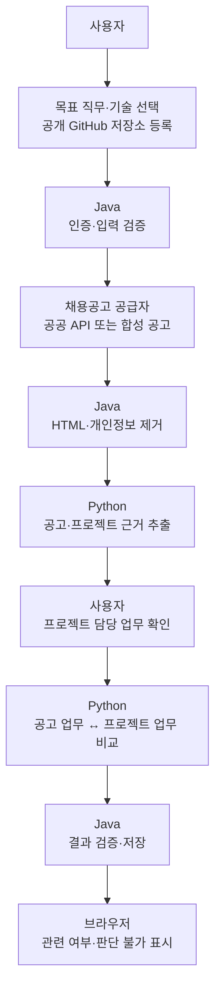

# Career Compass AI

> 공개 GitHub 프로젝트의 담당 업무와 채용공고의 담당 업무를 비교해
> **관련 여부와 판단 근거**를 보여주는 개발 직군 취업 분석 서비스입니다.

사용자가 목표 직무와 기술, 공개 저장소를 선택하면 프로젝트 근거를 추출합니다.
사용자가 확인한 근거만 채용공고와 비교하며, 합격 가능성이나 종합점수는 만들지 않습니다.

## 핵심 원칙

- 공고와 프로젝트 원문에서 확인할 수 있는 내용만 결과로 사용합니다.
- Java는 인증, 입력 검증, 작업 상태와 저장을 담당합니다.
- Python은 근거 추출과 담당 업무의 의미 비교를 담당합니다.
- 같은 평가 자료로 모델을 비교해 `qwen2.5`를 의미 비교 모델로 선택했습니다.
- Ubuntu 서버에서 Docker Compose로 Java, Python, PostgreSQL을 연결했습니다.

> Java 21 · Spring Boot · Python · FastAPI · Ollama/Gemini · PostgreSQL · Docker

## MVP 범위

| 구분 | MVP 기준 |
|---|---|
| 대상 사용자 | 공개 GitHub 프로젝트가 있는 개발 직군 취업 준비자 |
| 채용 데이터 | 공공취업정보 API 실연동 자료와 개발 직군 합성 공고 |
| 사용자 입력 | 목표 직무, 표준 기술 태그, 공개 GitHub 저장소 |
| 제공 결과 | 공고 업무와 프로젝트 업무의 관련 여부, 판단 불가 사유 |
| 제공하지 않음 | 합격 확률, 지원자 순위, 근거 없는 추천, 종합점수 |
| 제외 범위 | PDF·이력서 업로드, 민간 채용시장 전체 분석, 임의 웹 크롤링 |

현재 MVP는 담당 업무의 의미 비교를 제공합니다.
필수·우대 기술 조건 판정은 후속 범위입니다.

## 실제 데이터 검증

고용24 채용정보 API는 기업회원 자격이 필요해 사용할 수 없었습니다.
대신 승인받은 **인사혁신처 공공취업정보 API**의 목록과 상세 XML을 실제로 연결했습니다.

`전산`을 검색했지만 오래된 행정 공고와 일반 채용이 주로 조회됐습니다.
상세 원문에도 개발 담당 업무가 부족해 비교 근거를 만들 수 없는 경우가 많았습니다.
없는 내용을 보완하지 않고 `공고 담당업무 근거 부족`으로 처리합니다.

| 검증 대상 | 확인 결과 | 사용 범위 |
|---|---|---|
| 공공취업정보 API | 목록·상세 조회 성공, 개발 담당 업무 근거 부족 확인 | 실데이터 연결과 품질 확인 |
| 합성 공고 | 개발 직군별 추출·비교를 반복할 수 있음 | 모델 평가와 시연 |
| 내부 테스트 서버 | 로그인부터 결과 화면까지 Docker 환경에서 실행 | 연결·배포 검증 |
| Java 테스트 | 169건 통과, 실패·오류·비활성 0건 | 회귀 검증 |

합성 공고는 샘플로 표시하며 실제 채용시장 통계로 사용하지 않습니다.
공공 API 연결 성공이 곧 분석 가능한 데이터 확보를 뜻하지는 않았습니다.

## 사용자 흐름



프로젝트 담당 업무 후보를 사용자가 확인하면 분석이 다시 시작됩니다.
공고 근거가 없을 때도 최종 화면에서 판단 불가 사유를 확인할 수 있습니다.

## 결과 원칙

| 결과 | 의미 |
|---|---|
| `RELATED` | 두 업무가 관련 있음 |
| `NOT_RELATED` | 두 업무가 관련 없음 |
| `NOT_CALCULABLE` | 한쪽 근거가 부족해 판단할 수 없음 |

근거 부족은 0점이나 장애가 아닙니다.
공고 또는 프로젝트 근거가 비면 모델을 호출하지 않고 판단 불가 결과를 저장합니다.
상세 규칙은 [채용공고 분석 결과 API](docs/api/job-analysis-result-api.md)를 따릅니다.

`nomic-embed-text`는 관련 없는 문장에도 높은 점수를 주어 채택하지 않았습니다.
같은 평가 자료로 다시 확인해 `qwen2.5`를 선택했습니다.
평가 범위는 [의미 비교 방식](docs/architecture/job-fit-semantic-similarity.md)에 정리했습니다.

## 시스템 책임

| 영역 | 담당 |
|---|---|
| 브라우저 | 사용자 입력, 프로젝트 근거 확인, 진행 상태와 결과 표시 |
| Java | 인증·인가, 공공 API 호출, 개인정보 제거, 작업 상태와 결과 저장 |
| Python | 공고·프로젝트 근거 추출, 담당 업무 의미 비교 |
| PostgreSQL | 프로필 버전, 프로젝트 출처, 분석 작업과 결과 저장 |
| `contracts` | 서버 간 요청·응답, 상태값, 근거 참조와 오류 기준 |

Python은 공공데이터 API 키, 사용자 세션 또는 임의 URL을 받지 않습니다.
Java가 외부 접근과 개인정보 제거를 담당하고 필요한 텍스트만 Python에 전달합니다.

## 현재 구현 상태

기준일: **2026-08-20**

### 구현·검증 완료

- GitHub OAuth, 사용자별 데이터 격리와 공개 저장소 등록
- 목표 직무와 기술 태그 프로필 저장
- 공공취업정보 목록·상세 XML 조회와 개인정보 제거
- 공고 및 프로젝트 담당 업무 근거 추출
- 프로젝트 후보 확인·거부와 분석 자동 재개
- 공고 업무와 프로젝트 업무 비교
- 비교 결과 저장과 `COMPLETED / PARTIALLY_COMPLETED` 상태 전이
- 브라우저의 확인 화면, 관련 여부와 판단 불가 사유 표시
- Docker Compose 기반 테스트 서버 배포
- 요청 ID 기반 Java–Python 로그 추적
- 모델 호출 시간·토큰·오류 집계

### 확인된 한계

- 공공취업정보 API는 개발 직군의 최신 공고와 담당 업무가 부족합니다.
- 합성 공고는 분석 흐름을 재현하지만 실제 채용시장 자료는 아닙니다.
- 필수·우대 기술 조건 판정은 현재 결과 화면에 포함되지 않습니다.
- AWS 배포는 MVP 완료 조건에 포함하지 않습니다.

### 종료 전 확인

합성 공고에서 프로젝트 담당 업무를 확정한 뒤
`RELATED / NOT_RELATED` 결과가 표시되는 브라우저 흐름을 한 번 더 확인합니다.

## 구현 과정에서 확인한 문제

| 문제 | 대응 |
|---|---|
| 고용24 API를 개인 계정으로 운영할 수 없음 | 고용24를 제외하고 승인받은 공공 API를 연동 |
| 공공 API에 개발 담당 업무가 부족함 | 없는 내용을 만들지 않고 근거 부족으로 표시 |
| 공공 API XML과 오류 응답 형식이 다름 | HTTP 오류와 API 응답 오류를 나누어 검증 |
| 공고에 연락처와 HTML이 포함됨 | Java에서 제거한 뒤 Python으로 전달 |
| 모델 응답의 근거가 틀릴 수 있음 | Java에서 식별자와 근거 참조를 다시 검증 |
| 임베딩이 업무 차이를 구분하지 못함 | 같은 평가 자료로 모델을 비교해 `qwen2.5` 선택 |
| 추출 성공과 분석 완료가 혼동됨 | 추출, 사용자 확인, 비교, 완료 상태를 분리 |

## 기술 스택과 구조

- Backend: Java 21, Spring Boot, Spring Security, Spring Data JPA
- AI: Python, FastAPI, Pydantic, Ollama, Gemini 폴백
- Data: PostgreSQL, Flyway
- Integration: 공공취업정보 API, 합성 공고 공급자, GitHub OAuth·REST API
- Test: JUnit, Testcontainers, pytest, Postman
- Deployment: Docker Compose

처음 코드를 볼 때는 아래 세 경로를 따라가면 됩니다.

1. 채용공고 추출
   - Python: `job_posting_extraction.py`가 직무·기술·담당 업무와 원문 근거를 추출
   - Java: `PythonJobPostingExtractionClient`가 식별자·근거 참조·모델 실행 정보를 검증
2. 프로젝트 추출
   - Python: `repository_evidence.py`가 기술을 규칙으로 감지
   - Python: `project_responsibility_extraction.py`가 담당 업무 후보를 추출
   - Java: `PythonProjectResponsibilityExtractionClient`가 선택 기술·근거 참조·응답 개수를 검증
3. 담당 업무 비교
   - Python: `job_evidence_similarity.py`가 Ollama로 `RELATED / NOT_RELATED`를 판단
   - Java: `PythonEvidenceSimilarityClient`가 상태·식별자·판단값을 검증
   - Java: `JobEvidenceComparisonService`가 검증된 결과를 저장

공고 추출은 Ollama를 먼저 사용하고 실패한 단계만 Gemini로 다시 시도합니다.
프로젝트 기술 감지는 LLM을 사용하지 않으며, 프로젝트 담당 업무 추출과 최종 의미 비교는 Ollama가 담당합니다.
Python의 판단 결과는 바로 사용자에게 전달하지 않고 Java가 계약값과 원문 근거 참조를 확인한 뒤 저장합니다.

```text
career-compass-ai/
├─ backend-java/src/main/java/com/careercompass/
│  ├─ jobanalysis/
│  │  ├─ controller/JobAnalysisController.java      분석 생성·조회 API
│  │  ├─ worker/JobAnalysisWorker.java              공고 검색→추출→확인→비교 순서 제어
│  │  └─ service/JobEvidenceComparisonService.java  확정 근거 조립·비교 결과 저장
│  ├─ projectsource/                                 GitHub 저장소 확인·스냅숏 생성
│  ├─ projectresponsibility/                         후보 저장·사용자 확정·분석 재개
│  ├─ jobsearch/                                     공공 API·합성 공고 공급자
│  └─ pythonworker/client/
│     ├─ PythonJobPostingExtractionClient.java       공고 추출 호출·응답 검증
│     ├─ PythonProjectResponsibilityExtractionClient.java
│     └─ PythonEvidenceSimilarityClient.java         의미 비교 호출·응답 검증
├─ ai-python/app/
│  ├─ job_postings/router.py                         내부 분석 API 세 개
│  ├─ services/job_posting_extraction.py             공고 근거 추출
│  ├─ services/repository_evidence.py                매니페스트 기반 기술 감지
│  ├─ services/project_responsibility_extraction.py  프로젝트 담당 업무 후보 추출
│  ├─ services/job_evidence_similarity.py            공고↔프로젝트 업무 의미 비교
│  ├─ providers/                                     Ollama·Gemini 호출
│  └─ guardrails/                                    외부 모델 전송 전 연락처 제거
├─ contracts/                                        Java–Python 요청·응답 기준
├─ docs/                                             정책, API, 아키텍처와 검증 기록
├─ deploy/                                           Docker 배포 설정
└─ postman/                                          연결 테스트 자료
```

Python 내부 API는 `/job-postings/extract`, `/project-responsibility-extractions`,
`/job-evidence-similarities`이며 모두 `/internal/v1` 아래에서 Java만 호출합니다.

## 실행과 검증

개발과 빌드는 Linux에서 수행합니다.
비밀키와 인증정보는 환경변수로 주입하며 Git에 저장하지 않습니다.

```text
Java·Python 단위 테스트
→ Java–Python 연결 테스트
→ Docker 테스트 서버 배포
→ 브라우저 로그인·분석·결과 확인
```

## 주요 문서

- [영어·코드 용어 한글 뜻](docs/glossary.md)
- [공공기관 채용공고 분석 범위](docs/architecture/public-institution-job-analysis.md)
- [개발 직군 합성 공고](docs/testing/synthetic-job-posting-fixtures.md)
- [채용공고 분석 API](docs/api/developer-job-analysis-api.md)
- [채용공고 결과 API](docs/api/job-analysis-result-api.md)
- [채용공고 추출 기준](contracts/job-posting-extraction.md)
- [프로젝트 담당 업무 추출 기준](contracts/project-responsibility-extraction.md)
- [담당 업무 비교 기준](contracts/job-evidence-similarity.md)
- [서버 연결·배포 점검](docs/operations/runtime-connectivity-runbook.md)

## 이 프로젝트에서 증명한 것

- 사용할 수 없는 외부 API를 확인하고 범위를 다시 정했습니다.
- 실제 공공 API를 연결해 개발 직군 데이터의 한계를 확인했습니다.
- 근거가 없을 때 내용을 만들지 않고 판단 불가로 처리했습니다.
- 같은 자료로 비교해 의미 비교 모델을 선택했습니다.
- Java, Python, PostgreSQL을 컨테이너로 연결했습니다.
- 단위 테스트, 서버 연결, 브라우저 결과를 나누어 검증했습니다.

현재 MVP는 프로젝트 근거 확인부터 공고 담당 업무 비교와 결과 표시까지 연결돼 있습니다.
공공데이터의 품질 한계는 합성 공고로 숨기지 않고 별도로 공개합니다.
