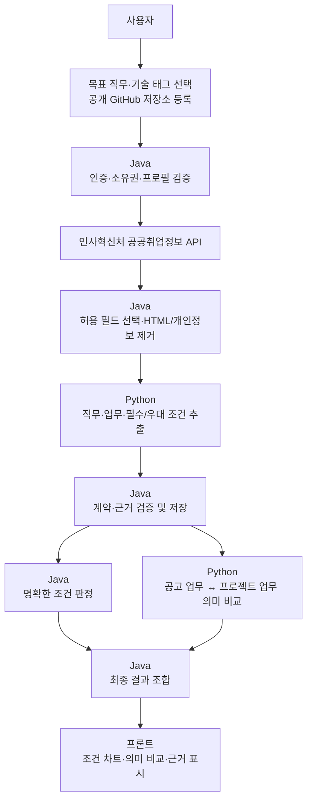

# Career Compass AI

> 사용자의 기술과 공개 프로젝트 근거를 공공기관 개발자 채용공고와 비교해
> **충족한 조건, 확인이 필요한 조건, 업무 경험의 연관성**을 근거와 함께 보여주는 취업 방향 분석 서비스입니다.

Career Compass AI는 단순 채용공고 검색이나 LLM의 합격 가능성 생성 서비스가 아닙니다.
사용자가 직접 선택한 기술과 공개 GitHub 프로젝트를 기준으로 필수·우대 조건을 비교하고,
결과가 나온 이유를 공고와 프로젝트 근거로 확인할 수 있게 만드는 프로젝트입니다.

## 해결하려는 문제

개발자 채용공고에는 기술, 경력, 학력, 자격증과 담당 업무가 섞여 있습니다. 지원자는 다음
질문에 일관된 기준으로 답하기 어렵습니다.

- 내가 충족한 필수·우대 조건은 무엇인가?
- 정보가 부족해서 아직 판단할 수 없는 조건은 무엇인가?
- 내 프로젝트 업무가 공고의 실제 담당 업무와 얼마나 관련 있는가?
- 결과를 뒷받침하는 공고 문장과 프로젝트 근거는 무엇인가?

명확한 조건과 의미 해석이 필요한 업무를 분리합니다. Java는 검증 가능한 규칙을 판정하고,
Python은 정제된 최소 근거 안에서 구조화 추출과 의미 비교를 담당합니다.

## MVP 비즈니스 범위

| 구분 | MVP 기준 |
|---|---|
| 대상 사용자 | 공개 GitHub 프로젝트가 있는 개발 직군 취업 준비자 |
| 채용 데이터 | 인사혁신처 공공취업정보의 공공기관 개발 직군 공고 |
| 사용자 입력 | 목표 직무, 표준 기술 태그, 사용자가 등록한 공개 GitHub 저장소 |
| 제공 결과 | 필수·우대 조건 비교, 확인 필요 항목, 업무 의미 비교와 근거 |
| 제공하지 않음 | 합격 확률, 지원자 순위, 근거 없는 추천, 불투명한 종합점수 |
| MVP 제외 | PDF·이력서 업로드, 민간 채용시장 전체 분석, 임의 웹 크롤링 |

고용24 채용정보 API는 기업회원 자격이 필요해 개인 개발 프로젝트의 운영 데이터 출처로
사용할 수 없었습니다. 샘플 데이터만 서비스 결과처럼 제시하지 않고 정식 승인받은
**인사혁신처 공공취업정보 API**로 범위를 전환했습니다. 실제 목록·상세 XML과 공공기관
필터를 확인했으며, 이 결과가 민간 채용시장 전체를 대표한다고 주장하지 않습니다.

## 사용자와 데이터 흐름



현재 연결·브라우저 테스트에서는 **공고 검색 → 개인정보가 제거된 원문 전달 →
Python 구조화 추출 → 공고 정보 추출 완료 표시**까지 확인했습니다.

조건 비교·의미 비교·최종 결과 차트는 계약을 정리한 상태이며 구현 전입니다. 따라서 현재
시스템은 추출 성공을 최종 분석 성공으로 표시하지 않고
`COMPARING_EVIDENCE / COMPARISON_STAGE_NOT_IMPLEMENTED`로 구분합니다.

## 결과 판단 원칙

### Java의 조건 판정

| 상태 | 의미 | 계산 |
|---|---|---:|
| `MATCHED` | 공고 조건과 사용자가 확인한 근거가 일치 | 1점 |
| `MISMATCHED` | 사용자가 미보유라고 명시적으로 확인 | 0점 |
| `NEEDS_REVIEW` | 사용자 또는 공고 정보가 부족 | 제외 |
| `NOT_APPLICABLE` | 공고가 조건을 명시하지 않음 | 제외 |

기술 목록에 없다는 이유만으로 `MISMATCHED`를 만들지 않습니다. 현재 프로필은 ‘미보유’와
‘미입력’을 완전히 구분하지 못하므로 근거가 없으면 `NEEDS_REVIEW`로 남깁니다.
필수조건과 우대조건의 일치율도 분리합니다.

### Python의 의미 비교

Python은 공고 담당 업무와 사용자 프로젝트 업무의 의미 관계만 비교합니다. 이 값은 합격
확률이나 실제 수행 능력 보장이 아니며 Java의 조건 판정을 변경할 수 없습니다.

`nomic-embed-text` 실험에서는 관련 없는 문장도 거의 같은 최고값이 나왔습니다. 특정 모델을
성급하게 확정하지 않고 Gemini 임베딩과 Ollama LLM-as-judge를 동일 fixture로 평가한 뒤
구현 방식을 결정합니다.

### 근거 우선

- 직접 확인된 내용만 사실로 사용하고 추정·확인 불가를 구분합니다.
- 주요 추출값과 비교 결과를 최소 근거 식별자에 연결합니다.
- LLM은 Java가 확정한 조건 상태와 수치를 바꿀 수 없습니다.
- 조건 결과와 의미 비교를 하나의 불투명한 총점으로 합치지 않습니다.

## 시스템 책임

| 영역 | 담당 |
|---|---|
| 프론트 | 사용자 입력, 진행 상태, 조건 차트·의미 비교·근거 표시 |
| Java | 인증·인가, 공공 API 호출, 개인정보 필터, 작업 상태, 조건 판정, 결과 저장 |
| Python | 공고 구조화 추출, 프로젝트 업무 근거 처리, 의미 비교, 모델 실행 정보 |
| PostgreSQL | 프로필 버전, 프로젝트 출처, 분석 작업과 검증된 결과 저장 |
| `contracts` | 서버 간 스키마, enum, 근거 참조, 오류와 보안 경계 |

Python은 공공데이터 API 키, 사용자 JWT 또는 임의 URL을 받지 않습니다. 외부 데이터 접근은
Java가 통제하고 Python에는 분석에 필요한 최소 텍스트와 식별자만 전달합니다.

## 현재 구현 상태

기준일: **2026-08-11**

### 확인 완료

- GitHub OAuth와 사용자별 데이터 격리
- 목표 직무·기술 태그 프로필과 공개 GitHub 저장소 등록
- 공공취업정보 목록·상세 XML, 공공기관 필터와 개발 직군 검색
- Java Worker의 공고 정제·Python 호출
- Ollama 기반 공고 구조화 추출과 근거·응답 계약 검증
- 추출 결과와 모델 실행 정보 저장
- 브라우저의 분석 진행 및 ‘공고 정보 추출 완료’ 표시
- 요청 ID 기반 Java–Python 로그 추적

### 다음 구현

- 사용자 프로젝트 업무 근거의 생성·확인·버전 관리
- Java 필수·우대 기술 조건 판정
- Python 업무 의미 비교 방식 평가 및 구현
- 비교 결과 저장과 `COMPLETED / PARTIALLY_COMPLETED` 상태 전이
- 분석 결과 API와 결과 차트
- 전체 브라우저 테스트 후 서버 배포 테스트

상세 검증 상태는 [현재 작업 상태](docs/current-work.md)에서 관리합니다.

## 설계 과정에서 해결한 문제

| 문제 | 해결 방향 |
|---|---|
| 고용24 API를 개인 계정으로 운영할 수 없음 | 고용24를 제거하고 승인받은 공공데이터 API로 전환 |
| 공공 API XML과 오류 응답의 형식 차이 | Java가 HTTP·서비스 오류·목록/상세 계약을 각각 검증 |
| 공고에 연락처·HTML·지시문이 포함될 수 있음 | Java 허용 필드·개인정보 필터 후 Python에서 재검증 |
| LLM JSON이 비거나 근거가 틀릴 수 있음 | Java가 enum, 식별자, 근거 참조와 모델 실행 정보를 검증 |
| 임베딩 점수가 업무 차이를 구분하지 못함 | 모델 고정 대신 동일 fixture 품질 게이트 도입 |
| 추출 성공을 최종 성공으로 오해할 수 있음 | 추출 완료와 비교·분석 완료 상태 분리 |

## 기술 스택과 구조

- Backend: Java 21, Spring Boot, Spring Security, Spring Data JPA
- AI: Python, FastAPI, Pydantic, Ollama, Gemini 후보
- Data: PostgreSQL, Flyway
- Integration: 인사혁신처 공공취업정보 API, GitHub OAuth·REST API
- Test: JUnit, Testcontainers, pytest, Postman
- Deployment: Docker Compose 기반 구성

```text
career-compass-ai/
├─ backend-java/   Java API, 보안, 공공데이터 연동, 작업 상태와 조건 판정
├─ ai-python/      구조화 추출, 근거 처리와 의미 비교
├─ contracts/      Java–Python 요청·응답 계약
├─ docs/           정책, API 명세, 아키텍처 결정과 작업 상태
├─ deploy/         배포 설정
└─ postman/        연결 테스트 자료
```

## 실행과 검증

Java와 Python 개발·빌드·서버 실행은 Linux에서 수행합니다. 비밀키와 인증정보는 환경변수로
주입하며 Git에 저장하지 않습니다.

```text
PUBLIC_EMPLOYMENT_API_SERVICE_KEY
PYTHON_WORKER_BASE_URL
INTERNAL_SERVICE_TOKEN
OLLAMA_MODEL
OLLAMA_JOB_POSTING_RESPONSIBILITY_MODEL
```

완료 여부는 다음 순서로 검증합니다.

```text
Java·Python 단위 테스트
→ 두 서버 실제 연결 테스트
→ 브라우저 전체 흐름 테스트
→ 배포 후 서버 테스트
```

## 주요 문서

- [영어·코드 용어 한글 뜻](docs/glossary.md)

- [현재 작업 상태](docs/current-work.md)
- [공공기관 채용공고 분석 책임 경계](docs/architecture/public-institution-job-analysis.md)
- [공공기관 개발 직군 검색 키워드](docs/architecture/public-institution-search-keywords.md)
- [채용공고 분석 API](docs/api/developer-job-analysis-api.md)
- [채용공고 결과 API 제안](docs/api/job-analysis-result-api.md)
- [채용공고 추출 계약](contracts/job-posting-extraction.md)
- [채용공고 근거 의미 비교 계약](contracts/job-evidence-similarity.md)
- [의미 비교 방식 평가 방향](docs/architecture/job-fit-semantic-similarity.md)
- [AI 협업 및 비즈니스 정책](AGENTS.md)

## 이 프로젝트가 보여주는 것

- 사용할 수 없는 외부 API를 확인하고 제품 범위를 재설계한 과정
- 외부 데이터와 LLM 응답을 계약과 근거로 검증하는 구조
- Java의 결정론적 판정과 Python의 의미 분석을 분리한 설계
- 개인정보와 모델 장애를 고려한 서버 간 데이터 경계
- 단위·연결·브라우저·배포 테스트를 구분한 완료 기준

현재는 공공공고 수집과 구조화 추출까지 연결됐으며, 비교 결과 구현과 배포 테스트가 다음
완료 목표입니다.
