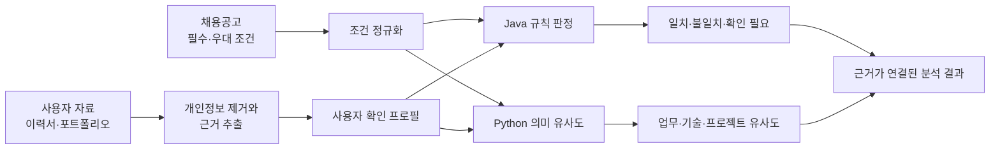
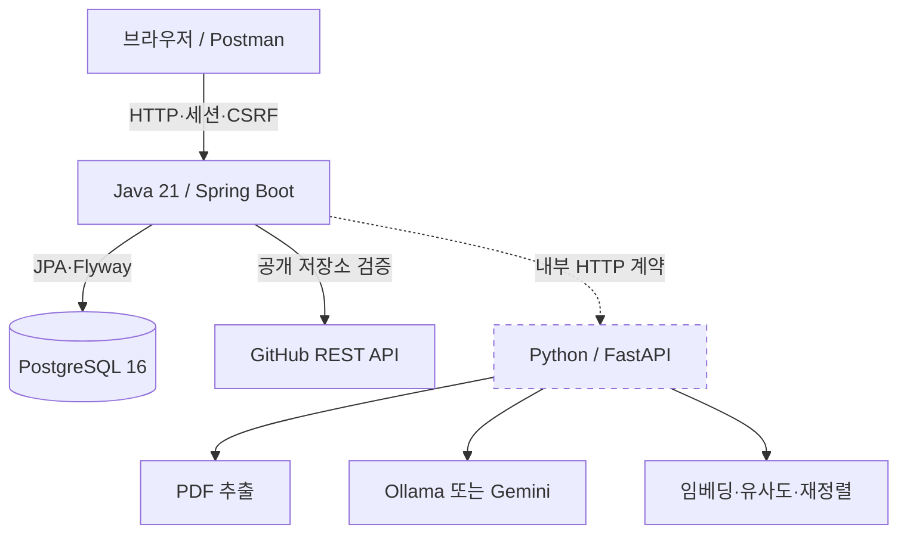
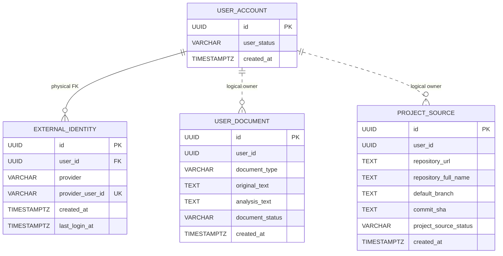

# Career Compass AI

이력서와 채용공고를 근거 중심으로 비교해, 지원 조건의 일치 여부와 보완할 역량을 설명하는 AI 취업 방향 분석 서비스입니다.

단순한 총점이나 합격 확률을 생성하지 않습니다. Java가 경력·학력·기술·지역처럼 명확한 조건을 규칙으로 판정하고, Python이 업무·기술·프로젝트 경험의 의미 유사도를 계산합니다. 모든 주요 결과는 원문 근거와 연결하며 정보가 부족하면 추측하지 않고 `확인 필요`로 남깁니다.

> 현재 MVP 개발 중입니다. 구현 및 검증 수준은 [현재 작업 상태](docs/current-work.md)에서 확인할 수 있습니다.

## MVP 최우선 범위

```text
PDF 등록
→ 추출 결과 수정·확정
→ 채용공고 등록
→ Java 조건 판정 + Python 의미 분석
→ 결과 화면
→ 테스트 서버 배포
```

8월 21일 MVP까지 이 흐름에 직접 필요하지 않은 부가기능은 우선 구현하지 않습니다.

## 핵심 분석 흐름



분석 결과는 다음 원칙을 지향합니다.

- 이력서에 없는 기술·경력·성과를 생성하지 않습니다.
- 필수조건과 우대조건을 분리합니다.
- 명확한 조건은 Java가 `일치`, `불일치`, `확인 필요`, `해당 없음`으로 판정합니다.
- 의미 유사도는 합격 확률이나 실제 수행 능력을 의미하지 않습니다.
- 개인정보가 제거된 최소 데이터만 Python과 외부 AI 제공자에 전달합니다.

## 현재 구현 상태

| 영역 | 기능 | 검증 상태 | 비고 |
| --- | --- | --- | --- |
| Java | GitHub OAuth 로그인과 세션 인증 | `UNIT_TESTED` | 실제 OAuth App 브라우저 로그인 미검증 |
| Java | 이력서·포트폴리오 텍스트 등록 | `INTEGRATION_TESTED` | 원문과 개인정보 제거 분석문 저장 |
| Java | 공개 GitHub 저장소 검증·등록 | `INTEGRATION_TESTED` | 기본 브랜치와 현재 커밋 SHA 저장 |
| Python | PDF 텍스트 추출 | `UNIT_TESTED` | Java 업로드 흐름과 미연결 |
| Python | 개인정보 제거(이메일·전화·주민등록번호) | `UNIT_TESTED` | 정규식 기반. 이름 등은 LLM 프롬프트 지시에만 의존, 완전한 보장 아님 |
| Python | 이력서 LLM 구조화 추출·근거 검증 | `UNIT_TESTED` | 실제 PDF·실제 Ollama로 검증. `OLLAMA_RESUME_MODEL=exaone3.5:latest` 평가 채택(1차 결과, 최종 확정 아님), 근거 없는 항목은 응답에서 제외 |
| Python | 채용공고 구조화 추출 API | `UNIT_TESTED` | `/internal/v1/job-postings/extract` 실제 구현·검증. 계약(`contracts/job-posting-extraction.md`)은 제안 상태 — 코덱스 확인 필요 |
| Python | 임베딩·유사도·재정렬 | `UNIT_TESTED` | 제공자 및 서비스 단위 검증, 실행 API 미연결 |
| 통합 | 이력서 입력부터 분석 결과까지 | 미구현 | Java–Python 분석 계약과 화면 필요 |

`INTEGRATION_TESTED` 이상이더라도 인증 변경 이후 다시 검증해야 하는 기능이 있습니다. Mock은 "예상된 응답이 오면 코드가 처리하는지"만 증명하며 네트워크·multipart·환경변수·외부 서비스(Ollama 등)·파일 권한 문제는 검증하지 못하므로, `UNIT_TESTED`에도 실제 파일과 실제 외부 서비스를 사용하는 호출을 포함하고 실제 통합 테스트를 별도 필수 단계로 거칩니다. 완료 상태의 정의와 근거는 [현재 작업 상태](docs/current-work.md)를 기준으로 합니다.

## 시스템 구성



점선은 아직 분석 실행 흐름으로 완전히 연결되지 않은 구간입니다.

Python(`8000` 포트)은 외부에 노출하지 않고 Java 서버만 내부망에서 접근합니다. 이 격리가 1차 방어선이고, 요청마다 검증하는 내부 서비스 토큰(`X-Internal-Token`)이 뚫렸을 때를 대비한 2차 방어선입니다.

### 책임 분리

| 구성 요소 | 책임 |
| --- | --- |
| `backend-java` | 인증·인가, 사용자 소유권, API, 저장, 명확한 조건 판정, Python 작업 제어와 최종 결과 조립 |
| `ai-python` | PDF 처리, 정보 추출, **개인정보 제거·검증 책임**, 임베딩, 의미 유사도와 LLM 실행 |
| `contracts` | Java–Python 요청·응답 JSON 계약과 공통 예제 |
| `deploy` | Docker Compose와 배포 설정 |
| `docs` | API·정책·설계·현재 검증 상태 |

### 문서 추출 흐름 소유권 (2026-07-29 합의)

병렬 작업 충돌을 줄이기 위해 "공통 구현"을 두지 않는다. 계약은 공동으로 정하고, 실행 제어는 Java, AI 처리는 Python이 맡는다.

- 프론트: `POST /api/v1/documents/{documentId}/extractions` 호출
- Java: 분석 시작, 권한 확인, `ExtractionTask` 생성·상태 관리 — 고정 메서드: `createExtractionTask`, `executeDocumentExtraction`, `retrieveExtractionTask`, `saveProfileCandidate`
- Python: `POST /internal/v1/documents/extract` 처리 — 계약 응답만 맞추면 내부 구성은 자유
- Java: Python 결과를 계약 스키마로 재검증하고 `ProfileCandidate`로 저장
- 프론트: 작업 상태와 결과를 조회

두 서버를 동시에 실행해야 하는 작업이므로, 사용자 API의 요청·응답·상태 코드부터 먼저 확정한 뒤 각자 구현한다. 확정 전에는 어느 쪽도 이 흐름 위에 새 코드를 쌓지 않는다.

## 기술 스택

### Backend

- [Java 21](https://docs.oracle.com/en/java/javase/21/)
- [Spring Boot 4.1.0](https://docs.spring.io/spring-boot/reference/)
- [Spring Security OAuth 2.0 Login](https://docs.spring.io/spring-security/reference/servlet/oauth2/login/index.html)
- Spring Data JPA
- PostgreSQL 16
- [Flyway](https://documentation.red-gate.com/flyway)
- Gradle, JUnit 5, Mockito, AssertJ, Testcontainers

### AI

- Python, FastAPI
- Ollama, Gemini
- PDF 텍스트 추출
- 임베딩, 코사인 유사도, 후보 재정렬

## API 명세

개발 중인 Java API의 기본 주소는 `http://localhost:8080`입니다. `dev`와 `prod` 프로필은 GitHub OAuth 로그인 후 발급된 `JSESSIONID` 세션을 사용하며, 상태 변경 요청은 CSRF 토큰이 필요합니다.

### 엔드포인트

| Method | Endpoint | 인증 | 성공 | 기능 |
| --- | --- | --- | ---: | --- |
| `GET` | `/actuator/health` | 불필요 | `200` | Java 서버 상태 확인 |
| `GET` | `/oauth2/authorization/github` | 불필요 | `302` | GitHub OAuth 로그인 시작 |
| `GET` | `/api/v1/auth/me` | 불필요 | `200` | 현재 인증 상태와 사용자 확인 |
| `GET` | `/api/v1/auth/csrf` | 불필요 | `200` | CSRF 헤더 이름과 토큰 발급 |
| `POST` | `/api/v1/auth/logout` | 세션·CSRF | `204` | 세션 무효화와 로그아웃 |
| `POST` | `/api/v1/documents` | 세션·CSRF | `201` | 이력서·포트폴리오 텍스트 등록 |
| `POST` | `/api/v1/project-sources/github` | 세션·CSRF | `201` | 공개 GitHub 저장소 검증·등록 |

### 공통 응답

```json
{
  "requestId": "f85cf40d-3994-454c-aedd-a310d8b3e938",
  "data": {},
  "error": null,
  "timestamp": "2026-07-29T09:00:00+09:00"
}
```

오류 응답은 `data`가 `null`이고 다음 오류 정보를 포함합니다.

```json
{
  "requestId": "9d74f739-18f2-4f0b-ad5b-1c593aa94214",
  "data": null,
  "error": {
    "errorType": "INVALID_INPUT",
    "message": "입력 내용을 확인해 주세요.",
    "fieldErrors": [],
    "retryable": false
  },
  "timestamp": "2026-07-29T09:00:00+09:00"
}
```

### 현재 사용자 조회

```http
GET /api/v1/auth/me
```

```json
{
  "authenticated": true,
  "userId": "60000000-0000-0000-0000-000000000001",
  "authenticationMode": "GITHUB",
  "githubLogin": "octocat"
}
```

로그인하지 않은 경우 `authenticated`는 `false`, `authenticationMode`는 `NONE`입니다. `githubLogin`은 로그인 확인 표시에만 사용하며 분석 근거나 사용자 프로필로 저장하지 않습니다.

### 문서 등록

```http
POST /api/v1/documents
Content-Type: application/json
X-CSRF-TOKEN: {token}
```

```json
{
  "documentType": "RESUME",
  "text": "Java와 Spring Boot를 사용한 백엔드 프로젝트 경험"
}
```

| 필드 | 타입 | 필수 | 규칙 |
| --- | --- | --- | --- |
| `documentType` | String | 예 | `RESUME`, `PORTFOLIO` |
| `text` | String | 예 | 공백이 아닌 문자열, 설정된 최대 길이 이하 |

성공 시 `201 Created`와 `Location: /api/v1/documents/{documentId}`를 반환합니다.

```json
{
  "documentId": "072c9f6f-d375-4856-ae7a-cfce1182ce67",
  "documentType": "RESUME",
  "documentStatus": "REGISTERED",
  "createdAt": "2026-07-29T00:00:00Z"
}
```

현재 Java는 이메일·전화번호·주민등록번호를 치환한 `analysisText`를 별도로 생성합니다. PDF 파일 업로드와 Python 구조화 추출 연결은 아직 구현되지 않았습니다.

### 공개 GitHub 저장소 등록

```http
POST /api/v1/project-sources/github
Content-Type: application/json
X-CSRF-TOKEN: {token}
```

```json
{
  "repositoryUrl": "https://github.com/octocat/Hello-World"
}
```

`https://github.com/{owner}/{repository}` 형식의 공개 저장소만 허용합니다. GitHub API에서 저장소와 기본 브랜치의 최신 커밋을 확인한 뒤 등록합니다.

```json
{
  "projectSourceId": "c7444fb5-0c6f-468c-b98d-ae05b6d0acd1",
  "repositoryUrl": "https://github.com/octocat/Hello-World",
  "repositoryFullName": "octocat/Hello-World",
  "defaultBranch": "master",
  "commitSha": "7fd1a60b01f91b314f59955a4e4d4e80d8edf11d",
  "status": "REGISTERED"
}
```

### 주요 오류

| HTTP | `errorType` | 조건 |
| ---: | --- | --- |
| `400` | `INVALID_INPUT` | 필수값 누락, 잘못된 JSON 또는 문서 종류 |
| `400` | `INVALID_GITHUB_REPOSITORY_URL` | 허용되지 않은 GitHub URL |
| `401` | `UNAUTHORIZED` | 로그인 세션 없음 |
| `403` | `FORBIDDEN` | 권한 또는 CSRF 검증 실패 |
| `404` | `GITHUB_REPOSITORY_UNAVAILABLE` | 공개 저장소를 확인할 수 없음 |
| `413` | `PAYLOAD_TOO_LARGE` | 문서 텍스트 최대 길이 초과 |
| `429` | `GITHUB_RATE_LIMITED` | GitHub API 요청 한도 도달 |
| `503` | `GITHUB_SERVICE_UNAVAILABLE` | GitHub API 장애·거부된 리다이렉트·잘못된 응답 |

더 자세한 요청·응답과 Postman 확인 절차는 [Java API 문서](docs/README.md)와 [Postman 안내](postman/README.md)를 참고하세요.

## ERD

아래 ERD는 현재 Flyway `V1`~`V3` 마이그레이션을 기준으로 합니다.



`external_identity.user_id`에는 실제 외래 키가 있습니다. `user_document.user_id`와 `project_source.user_id`는 애플리케이션에서 사용자 소유권을 적용하지만 현재 DB 외래 키는 없으므로 데이터 무결성 보완이 필요합니다.

**주의**: `user_document.original_text`는 사용자가 등록한 원문을 그대로 저장합니다. 보관 동의 여부와 보관 기간이 아직 확정되지 않아 개인정보 정책과 충돌할 수 있습니다 — 정책 확정 전까지 원문 보관을 최종 사양으로 취급하지 않습니다.

## 프로젝트 구조

```text
career-compass-ai/
├─ backend-java/                 # Java API와 최종 비즈니스 판정
│  ├─ src/main/java/com/careercompass/
│  │  ├─ common/                 # 공통 응답, 예외 처리, 시간 설정
│  │  ├─ document/               # 사용자 문서 등록과 개인정보 제거
│  │  ├─ projectsource/          # 공개 GitHub 저장소 검증·등록
│  │  ├─ pythonworker/           # Python Worker HTTP 클라이언트
│  │  ├─ security/               # GitHub OAuth, 세션, CSRF, 현재 사용자
│  │  └─ user/                   # 사용자 계정과 외부 로그인 식별자
│  ├─ src/main/resources/
│  │  ├─ db/migration/           # Flyway 스키마 변경 이력
│  │  ├─ static/                 # 브라우저 확인 화면
│  │  └─ application.yml
│  ├─ src/test/                  # 단위·API·통합 테스트
│  ├─ build.gradle
│  └─ compose.yaml               # PostgreSQL 16
├─ ai-python/                    # 추출, 임베딩, 유사도와 LLM 실행
├─ contracts/                    # Java–Python JSON 계약
├─ deploy/                       # 배포 구성
├─ docs/                         # API·설계·현재 작업 상태
├─ postman/                      # Collection과 개발 환경
├─ AGENTS.md                     # 구현·보안·검증 규칙
└─ README.md
```

## 로컬 실행

개발과 빌드는 Linux 환경에서 수행합니다.

### 요구 사항

- Java 21
- Gradle
- Docker와 Docker Compose
- GitHub OAuth App

### 환경변수

```text
SPRING_PROFILES_ACTIVE=dev
DB_HOST=localhost
DB_PORT=<postgres-port>
DB_NAME=<database-name>
DB_USERNAME=<database-user>
DB_PASSWORD=<database-password>
DOCUMENT_MAX_TEXT_LENGTH=<maximum-text-length>
GITHUB_OAUTH_CLIENT_ID=<oauth-client-id>
GITHUB_OAUTH_CLIENT_SECRET=<oauth-client-secret>
SESSION_COOKIE_SECURE=false
GITHUB_API_CONNECT_TIMEOUT=<duration>
GITHUB_API_READ_TIMEOUT=<duration>
PYTHON_WORKER_BASE_URL=http://localhost:8000
INTERNAL_SERVICE_TOKEN=<long-random-shared-secret>
```

`SESSION_COOKIE_SECURE=false`는 로컬 개발 전용입니다. 운영 환경에서는 반드시 `true`로 설정해야 합니다.

GitHub OAuth App에는 브라우저에서 접속할 Java 서버 주소와 일치하는 callback을 등록해야 합니다.

```text
http://localhost:8080/login/oauth2/code/github
```

### 실행

```bash
cd backend-java
docker compose up -d
gradle bootRun
```

브라우저에서 `http://localhost:8080`을 열거나 다음 상태 API로 서버를 확인합니다.

```bash
curl http://localhost:8080/actuator/health
```

### 테스트

```bash
cd backend-java
gradle test
```

PostgreSQL 통합 테스트는 Docker를 사용할 수 있는 Linux 환경이 필요합니다.

## 문서

- [현재 작업 및 검증 상태](docs/current-work.md)
- [Java API 상세 명세](docs/README.md)
- [Java–Python 문서 추출 계약](contracts/document-extraction.md)
- [분석 계층 책임과 정책](docs/analysis-responsibility-boundaries.md)
- [Postman 실행 안내](postman/README.md)
- [AI 협업 및 보안 규칙](AGENTS.md)

## 현재 한계와 다음 목표

- PDF 업로드부터 분석 결과까지 이어지는 사용자 흐름이 아직 없습니다.
- Java–Python 분석 실행 API와 공통 예제 JSON 계약 테스트가 필요합니다.
- AI 추출 후보를 사용자가 확인·수정·확정하는 화면이 필요합니다.
- 원문 텍스트 보관 동의와 보관 기간은 아직 확정되지 않았습니다.
- `user_document`와 `project_source`의 DB 외래 키 보완이 필요합니다.
- GitHub 저장소 분석은 현재 등록까지만 구현되어 있으며 핵심 분석 흐름에는 연결되지 않았습니다.

가장 가까운 목표는 이력서 입력과 채용공고 하나를 근거 기반으로 비교해 `일치`, `불일치`, `확인 필요`와 의미 유사도를 한 화면에서 설명하는 것입니다.
